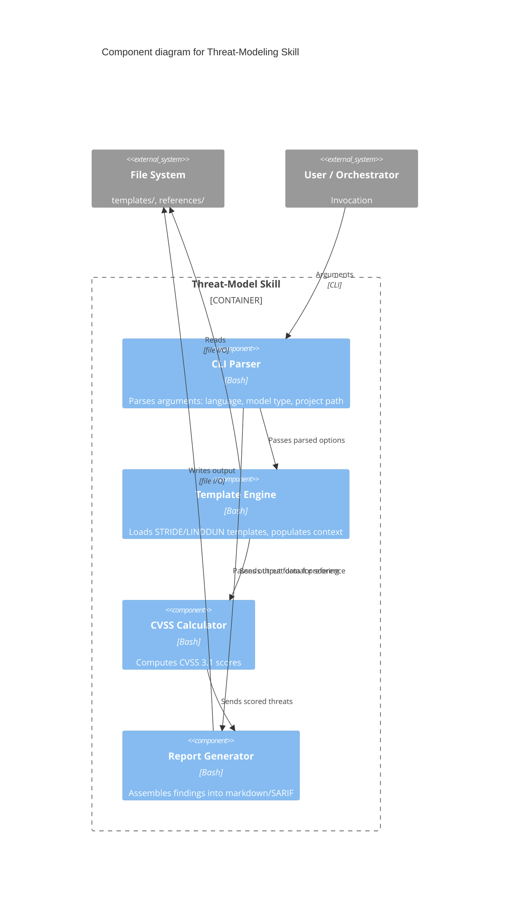
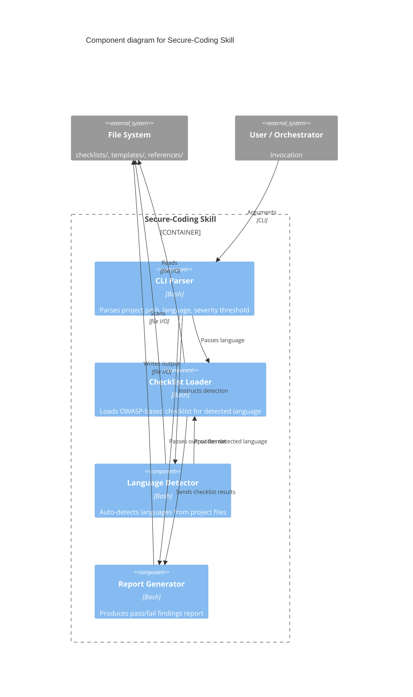

# C4 Component Diagram — Skill Internals

## Threat-Modeling Skill Internals

The threat-modeling skill is composed of four internal components that process user input through a structured pipeline.

### Components

| Component | Description |
|-----------|-------------|
| **CLI Parser** | Parses arguments (language, threat model type, project path) and validates input |
| **Template Engine** | Loads STRIDE or LINDDUN templates from `templates/`, populates with project context |
| **CVSS Calculator** | Computes CVSS 3.1 scores for identified threats based on user-provided impact metrics |
| **Report Generator** | Assembles findings into markdown or SARIF output |

## Secure-Coding Skill Internals

The secure-coding skill applies language-specific secure coding checklists to a project.

### Components

| Component | Description |
|-----------|-------------|
| **CLI Parser** | Parses project path, language, and severity threshold arguments |
| **Checklist Loader** | Loads the appropriate OWASP-based checklist for the detected language |
| **Language Detector** | Auto-detects programming languages from project file extensions |
| **Report Generator** | Produces a findings report with pass/fail status per checklist item |

