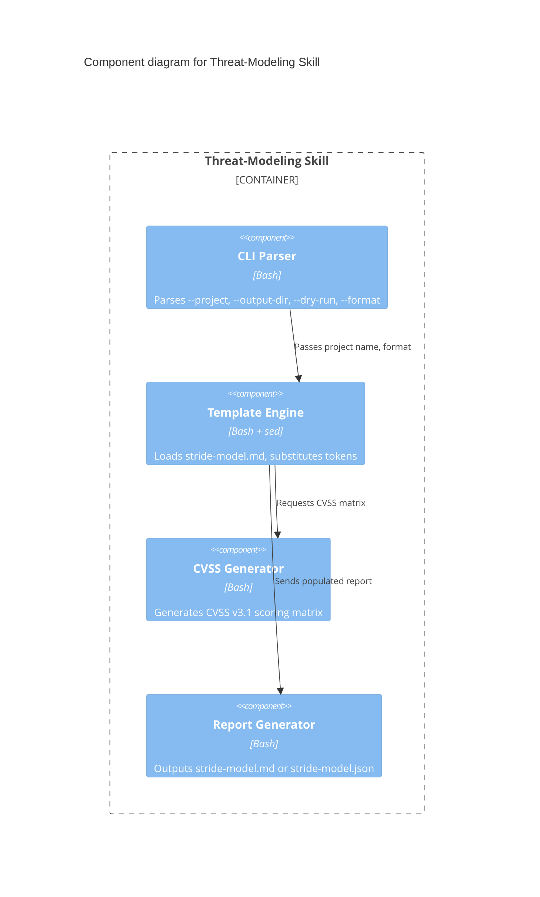
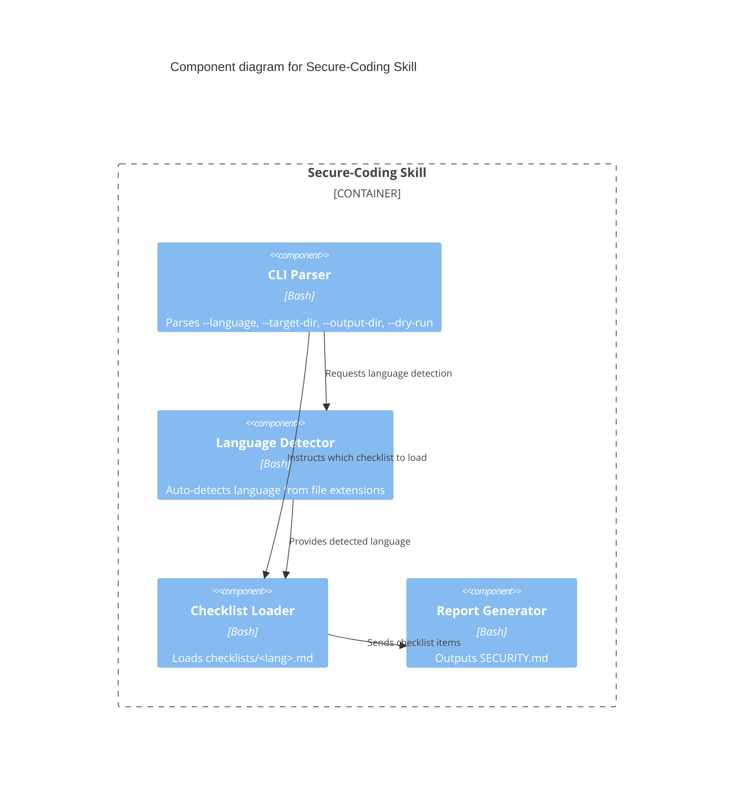

# C4 Component Diagram — Skill Internals

## Threat-Modeling Skill Internals

The threat-modeling skill is composed of four internal components that process user input through a structured pipeline.

### Components

| Component | Description |
|-----------|-------------|
| **CLI Parser** | Parses arguments (`--project`, `--output-dir`, `--dry-run`, `--format`) and validates input |
| **Template Engine** | Loads STRIDE template from `templates/stride-model.md`, substitutes `{{PROJECT_NAME}}`, `{{DATE}}`, `{{CVSS_MATRIX}}`, `{{STRIDE_TABLE}}` tokens |
| **CVSS Generator** | Populates a CVSS v3.1 score matrix table with threat-specific metrics (AV, AC, PR, UI, S, C, I, A) |
| **Report Generator** | Assembles findings into markdown or JSON output |

### Component Diagram

## Secure-Coding Skill Internals

### Components

| Component | Description |
|-----------|-------------|
| **CLI Parser** | Parses arguments (`--language`, `--target-dir`, `--output-dir`, `--dry-run`) and validates input |
| **Language Detector** | Auto-detects language from file extensions (`.js`, `.ts`, `.py`, `.go`, `.rs`) when `--language` is not specified |
| **Checklist Loader** | Loads the appropriate OWASP-based checklist from `checklists/<lang>.md` |
| **Report Generator** | Assembles checklist items and violations into `SECURITY.md` using template substitution |

### Component Diagram

