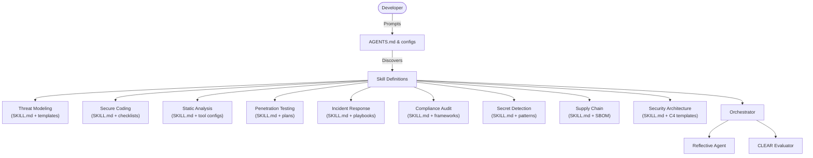

# C4 Container Diagram: CyberSecurity Superpowers

## Container Security

| Container | Security Controls |
|-----------|------------------|
| AGENTS.md | Defines agent behavior constraints |
| Skill Definitions | YAML frontmatter with metadata validation |
| Orchestrator | Task routing with security gate enforcement |
| Reflective Agent | Self-review validation pipeline |
| CLEAR Evaluator | Metrics-based quality assurance |