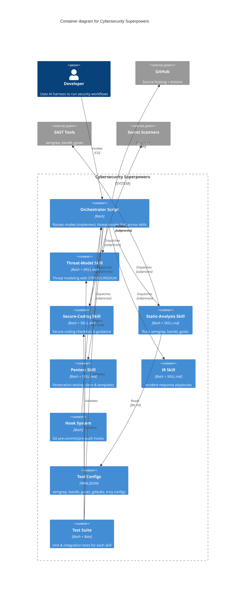

# C4 Container Diagram — Cybersecurity Superpowers

## Containers

| Container | Description | Technology |
|-----------|-------------|------------|
| **Orchestrator Script** | Routes modes (implement, threat-model, full) across skills | Bash, mode routing via argument parsing |
| **5 Skill Scripts** | Individual `run.sh` for threat-model, secure-coding, static-analysis, pentest, ir | Bash, SKILL.md metadata |
| **Hook System** | Git pre-commit and pre-push hooks that trigger security checks | Bash, Git hooks |
| **Tool Configs** | YAML/JSON configurations for semgrep, bandit, gosec, gitleaks, trivy | YAML, JSON |
| **Test Suite** | Bats-based tests validating each skill and the orchestrator | Bash, Bats |

## Relationships

The orchestrator acts as the entry point. The developer (via AI harness) invokes it, which then dispatches to one or more skills. Each skill reads its own config from `tools/` and may invoke external security tools via subprocess. The hook system is triggered automatically by Git lifecycle events.

## Container Diagram

```mermaid
C4Container
  title Container diagram for Cybersecurity Superpowers

  Person(dev, "Developer", "Uses AI harness to run security workflows")

  System_Boundary(csb, "Cybersecurity Superpowers") {
    Container(orch, "Orchestrator Script", "Bash", "Routes modes (implement, threat-model, full) across skills")
    Container(threat, "Threat-Model Skill", "Bash + SKILL.md", "Threat modeling with STRIDE/LINDDUN")
    Container(seccode, "Secure-Coding Skill", "Bash + SKILL.md", "Secure coding checklists & guidance")
    Container(sast, "Static-Analysis Skill", "Bash + SKILL.md", "Runs semgrep, bandit, gosec")
    Container(pentest, "Pentest Skill", "Bash + SKILL.md", "Penetration testing plans & templates")
    Container(ir, "IR Skill", "Bash + SKILL.md", "Incident response playbooks")
    Container(hooks, "Hook System", "Bash", "Git pre-commit/pre-push hooks")
    Container(configs, "Tool Configs", "YAML/JSON", "semgrep, bandit, gosec, gitleaks, trivy configs")
    Container(tests, "Test Suite", "Bash + Bats", "Unit & integration tests for each skill")
  }

  System_Ext(github, "GitHub", "Source hosting + Actions")
  System_Ext(sast_tools, "SAST Tools", "semgrep, bandit, gosec")
  System_Ext(secrets, "Secret Scanners", "gitleaks")

  Rel(dev, orch, "Invokes", "CLI")
  Rel(orch, threat, "Dispatches", "subprocess")
  Rel(orch, seccode, "Dispatches", "subprocess")
  Rel(orch, sast, "Dispatches", "subprocess")
  Rel(orch, pentest, "Dispatches", "subprocess")
  Rel(orch, ir, "Dispatches", "subprocess")
  Rel(sast, configs, "Reads", "file I/O")
  Rel(sast, sast_tools, "Invokes", "subprocess")
  Rel(seccode, secrets, "Invokes", "subprocess")
  Rel(hooks, orch, "Triggers", "Git hook")
  Rel(tests, orch, "Validates")
  Rel(tests, threat, "Validates")
  Rel(tests, seccode, "Validates")
  Rel(orch, github, "Integrates", "API")
```

## Technology Decisions

| Decision | Rationale |
|----------|-----------|
| Bash for orchestrator and skills | Zero runtime dependencies, universally available in CI and dev environments |
| YAML for tool configs | Human-readable, version-control friendly, widely supported |
| GitHub Actions for CI | Tight integration with GitHub ecosystem, no additional infra |
| Bats for testing | Lightweight Bash testing framework, no language runtime required |