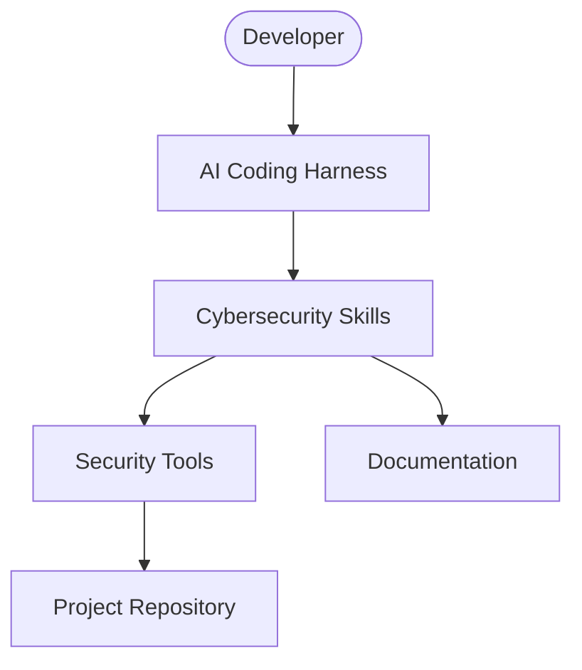

# C4 Context Diagram: CyberSecurity Superpowers

## System Description
CyberSecurity Superpowers provides AI-assisted security engineering through reusable skills that integrate with AI coding harnesses.

## External Dependencies
- AI Coding Harness (Claude Code, OpenCode, Cursor, etc.)
- Security Tools (git-secrets, gitleaks, semgrep, bandit, npm audit, etc.)
- Standards Bodies (OWASP, NIST, MITRE, CIS)

## Trust Boundaries
- Harness <-> Skills: Untrusted (execution context)
- Skills <-> Tools: Trusted (localhost, subprocess)
- Tools <-> Repo: Trusted (developer machine)