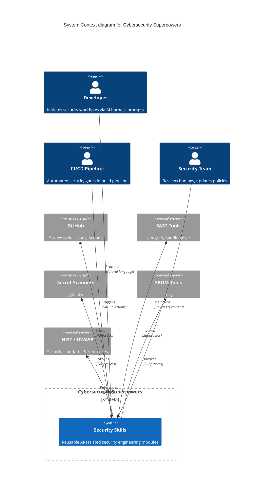

# C4 Context Diagram — Cybersecurity Superpowers

## System Boundary

The Cybersecurity Superpowers system provides AI-assisted security engineering through reusable skill modules that integrate with any AI coding harness. It acts as a security co-pilot, guiding developers through threat modeling, secure coding, static analysis, penetration testing, incident response, compliance auditing, secret detection, supply chain security, and security architecture reviews.

## External Actors

| Actor | Description |
|-------|-------------|
| **Developer** | Initiates security workflows via prompts to the AI harness |
| **CI/CD Pipeline** | Triggers automated security gates during build/deploy |
| **Security Team** | Reviews findings, updates policies, and maintains skill content |

## External Systems

| System | Interaction |
|--------|-------------|
| **GitHub** | Source code repository, issue tracking, Actions integration |
| **SAST Tools** (semgrep, bandit, gosec) | Static analysis invoked by skills |
| **Secret Scanners** (gitleaks) | Secret detection invoked by relevant skills |
| **SBOM Tools** (trivy) | Supply chain vulnerability scanning |
| **NIST / OWASP Standards** | Reference sources for skill knowledge bases |

## Context Diagram

```mermaid
C4Context
  title System Context diagram for Cybersecurity Superpowers

  Person(developer, "Developer", "Initiates security workflows via AI harness prompts")
  Person(cicd, "CI/CD Pipeline", "Automated security gates in build pipeline")
  Person(security, "Security Team", "Reviews findings, updates policies")

  System_Boundary(csb, "Cybersecurity Superpowers") {
    System(skills, "Security Skills", "Reusable AI-assisted security engineering modules")
  }

  System_Ext(github, "GitHub", "Source code, issues, Actions")
  System_Ext(sast, "SAST Tools", "semgrep, bandit, gosec")
  System_Ext(secrets, "Secret Scanners", "gitleaks")
  System_Ext(sbom, "SBOM Tools", "trivy")
  System_Ext(standards, "NIST / OWASP", "Security standards & references")

  Rel(developer, skills, "Prompts", "Natural language")
  Rel(cicd, skills, "Triggers", "GitHub Actions")
  Rel(security, skills, "Maintains", "Policies & content")
  Rel(skills, github, "Scans", "HTTPS/API")
  Rel(skills, sast, "Invokes", "Subprocess")
  Rel(skills, secrets, "Invokes", "Subprocess")
  Rel(skills, sbom, "Invokes", "Subprocess")
  Rel(skills, standards, "References", "HTTPS")
```

## Trust Boundaries

| Boundary | Description |
|----------|-------------|
| Developer → Skills | Untrusted (prompt injection possible via intent) |
| CI/CD → Skills | Trusted (controlled pipeline environment) |
| Skills → External Tools | Trusted (localhost subprocess execution) |
| Skills → GitHub/Standards | Untrusted (network boundary) |