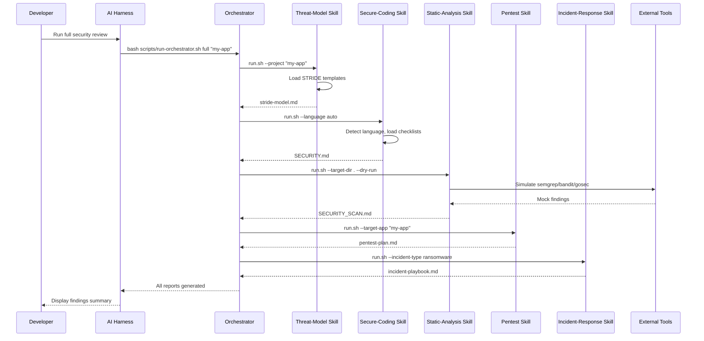
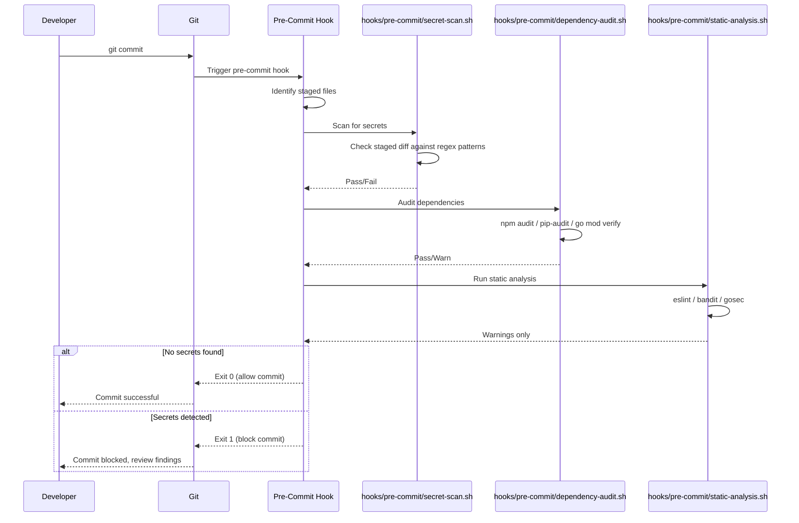
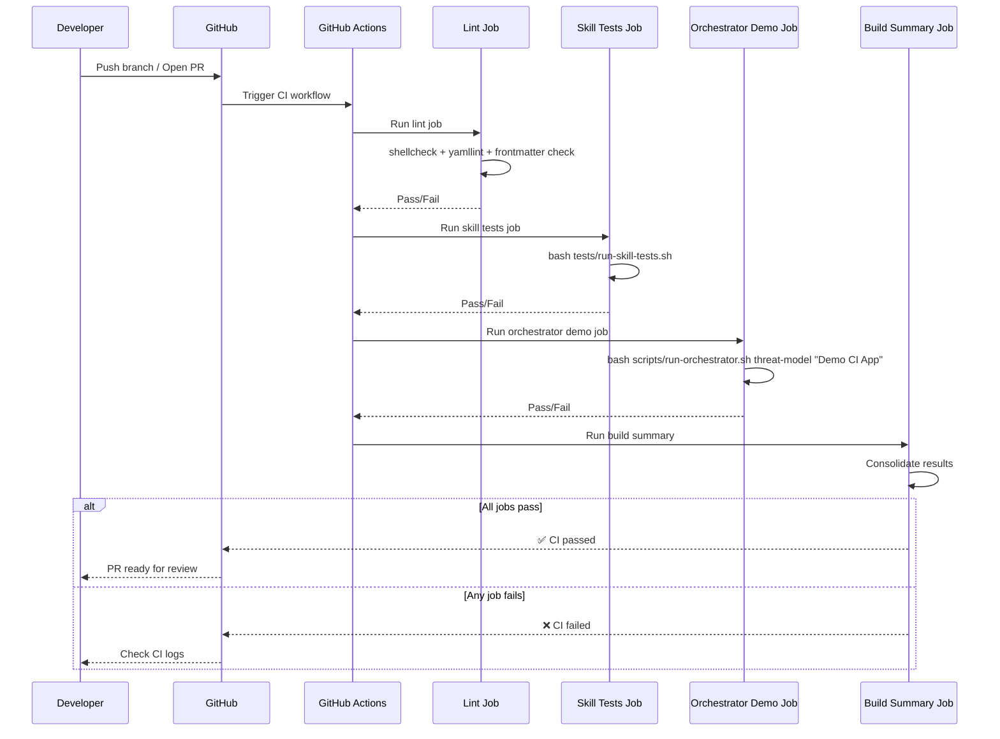

# Sequence Diagrams

## Diagram 1: Orchestrator `full` Mode Execution

The developer invokes the orchestrator in `full` mode, which runs all skills sequentially. Each skill executes its `run.sh` and returns results.

## Diagram 2: Pre-Commit Hook Execution Flow

A developer commits code, triggering the Git pre-commit hook. The hook runs secret detection, dependency audit, and static analysis on staged files.

## Diagram 3: CI Pipeline Execution Flow

A pull request is opened on GitHub, triggering a GitHub Actions workflow. The CI pipeline runs lint, skill tests, and orchestrator demo jobs.

