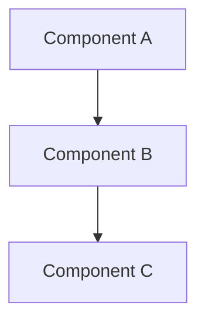

# C4 Component Diagram

## Container: [Container Name]

## Component Security

| Component | Responsibility | Security Controls | Dependencies |
|-----------|---------------|------------------|--------------|
| | | | |