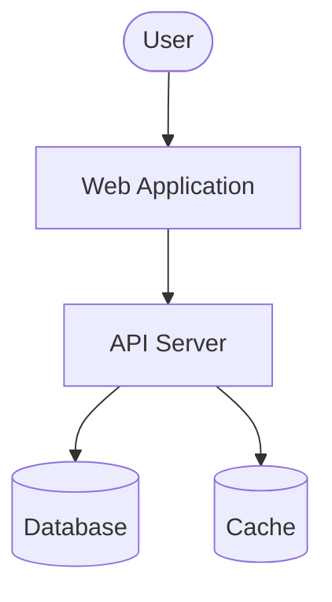

# C4 Container Diagram

## System: [System Name]

## Container Security

| Container | Technology | Security Controls | Threat Model |
|-----------|------------|------------------|--------------|
| | | Authentication, Authorization, Encryption | T-001, T-002 |
| | | Input Validation, Rate Limiting | T-003 |

## Data Flow Security

| Flow | Protocol | Encryption | Authentication |
|------|----------|------------|----------------|
| User -> WebApp | HTTPS | TLS 1.3 | JWT |