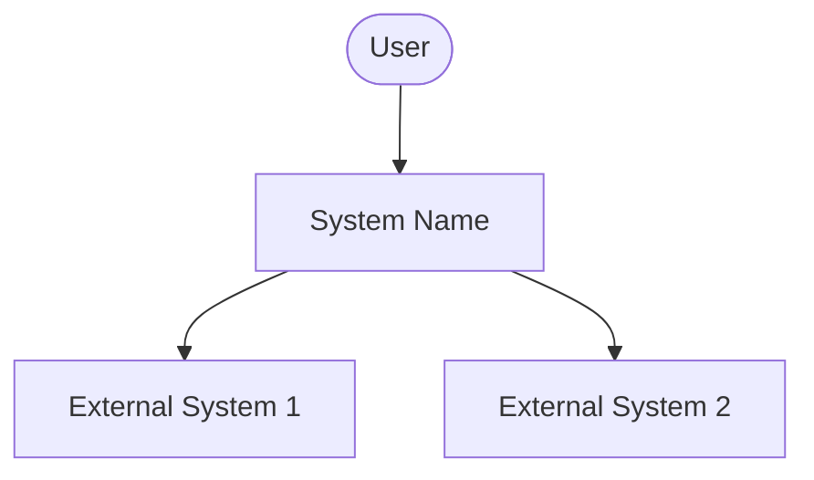

# C4 Context Diagram

## System: [System Name]

## Security Boundaries

- [Define trust boundaries]
- [Define data flow security requirements]

## External Systems

| System | Data Shared | Trust Level | Security Controls |
|--------|-------------|-------------|-------------------|
| | | | |