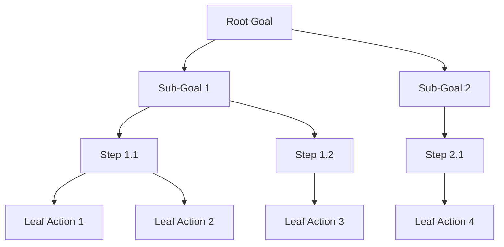

# Attack Tree

## Goal: [Root Goal]

## Leaf Node Analysis

| Leaf Node | Difficulty | Detection | Impact | Mitigation |
|-----------|------------|-----------|--------|------------|
| Leaf Action 1 | | | | |
| Leaf Action 2 | | | | |